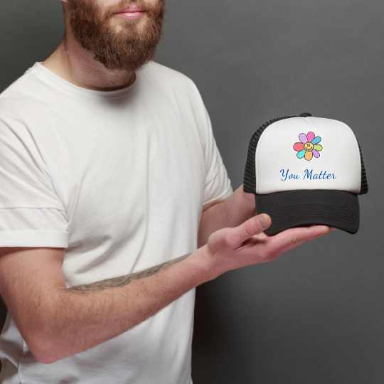

## Inspiration
Welcome to "You Matter" – a project in mental health support and community connection, representing a significant milestone in my 4th project for Code Institute. Imagine a space where understanding thrives, and empathy transforms challenges into triumphs. As a mental health practitioner, for me this isn’t just a  website development; it's about the people. 

# Agile Kanban Pre Planning 
Despite careful planning, the project did not unfold as intended. Unfortunately, the implementation of Django did not proceed as expected, despite having two different drafts.

 

# User Experience - UX

## Aim 

### Individuals Seeking Support
Those experiencing mental health challenges are looking for a supportive community where they can share their experiences, seek advice, and connect with others.

### Educational Seekers
Students, professionals, or anyone interested in accessing educational resources and practical tools to enhance their understanding of mental health and well-being.

Those who enjoy listening to authentic podcasts featuring insights from mental health professionals, seeking practical advice and perspectives to apply in their lives.

### Friends and Family of Those Affected
Individuals who want to gather information and resources to better understand and support friends, family members, or colleagues facing mental health challenges.

#### Philanthropic Individuals
Those who wish to make a positive impact on mental health initiatives and are interested in 
supporting the cause through transparent fundraising efforts.

## User Persona

In this section, I used UserPersona.dev free AI-powered User Persona Generator. By offering a concise description, it generates insightful user personas. The narratives presented below are inspired by real-life struggles, with due consideration given to privacy and protection through the alteration of names, locations, image and ages. 

- Story 1: Sarah (Teenager)

 

Sarah is a 17-year-old high school student who has been struggling with social anxiety. She often felt isolated and overwhelmed in crowded social situations, which affected her academic performance and overall well-being. One day, she stumbled upon the "You Matter" website, where she found articles and self-help resources specifically tailored to teenagers facing similar challenges. She joined a support group and gradually built the confidence to share her experiences. Through the encouragement and guidance of the group, Sarah learned strategies to manage her anxiety and discovered that she wasn't alone in her struggles. Today, Sarah is thriving in school and is excited about the future, thanks to the support and resources she found on the website.

- Story 2: Michael (Working Professional)

 

Michael, a 35-year-old working professional, had been dealing with work-related stress, anxiety, and burnout for years. He felt overwhelmed and on the brink of quitting his job. After a particularly tough week, he decided to search for mental health support online and came across the "You Matter" website. The resources on stress management, work-life balance, and burnout prevention resonated with him. He started using the self-assessment tools and strategies provided, which helped him regain control over his mental health. Michael also found an online support group for professionals in similar situations. With the support and insights he gained from the community, he made significant changes in his life and career, ultimately finding a better work-life balance and improved mental well-being.

- Story 3: Margaret (Retired Senior)

 

Margaret, an 80-year-old retiree, had been feeling increasingly lonely and anxious after losing her spouse and dealing with the challenges of aging. She discovered the "You Matter" website through her grandson and found a wealth of resources tailored to seniors facing mental health issues. The website provided information on coping with grief and isolation and tips for maintaining emotional well-being in later life. Margaret also joined an online seniors' support group where she met fellow retirees facing similar challenges. The connections she made and the compassionate discussions helped her combat her feelings of loneliness and find joy in her golden years. Margaret's experience demonstrates that it's never too late to seek support and that "You Matter" is there for people of all ages.

Testimonial 1:
" 'You Matter' changed my life. It's a sanctuary for teens like me with social anxiety. This place truly cares."

Testimonial 2:
" 'You Matter' saved my career. The resources and support here gave me control over my stress. It's a lifesaver."

Testimonial 3:
"At 80, I found joy again with 'You Matter.' The resources and support group keep me going. It's never too late to seek help."

# User Goals 

## First time visitor

- Welcoming design and clear message:
Users should sense a warm and inviting atmosphere when they enter the website with a welcoming visual appealing design and message.

- User-Friendly Navigation:
Users are able to navigate easily to explore around the website. The website is clear about different tabs and sections. 

- Responsiveness:
The website is responsive across various devices, ensuring a seamless experience for users accessing it from different platforms.

- Call to Action:
Users are inspired to take action, whether it's engaging/volunteering in the community, making a merchandise purchase, or sharing the resources with others.

- Events Calendar
Users should be able to access upcoming events and activities that they can join to further connect with the community, contribute to mental health initiatives, and participate in meaningful discussions.

## Second time visitor

- Updated upcoming events:
Updated highlights of any upcoming events or activities since my last visit, enticing me to explore new opportunities for community engagement.

- Community Testimonials:
Updated testimonials or success stories from community members, reinforcing the positive impact of the platform and inspiring continued participation.

## Frequent visitor

- Early Access Opportunities:
Opportunities for new features to be updated in the future alongside podcast episodes, upcoming events or merchandise releases, rewarding frequent visitors with something new always.

- Future new features
Users will be able to navigate through new future features and join through the journey of how the community grows. 

- Sharing with friends and families
Users at this point will be comfortable to share with friends, family or even colleagues to join the community. 

## Future Features 

- Personalised Greetings:
A personalised greeting recognizing that I'm a returning visitor, creating a sense of familiarity and acknowledging my previous interaction with the website.

- Newsletter subscription:
Subscription directly into members email 

- New updated features and designs
New designs and more user-friendly user journeys into the website. This is an area that will consistently need changing as we gather feedback and testers.

- Updated merchandise 
New collections to buy from 

- Blog Section
Add a blog section where people can share their stories. Each blog should also have the ability to comment below and the option to share through different social media platforms.

# User Design 

## Logo Design
 

## Merchandise Designs

Explore the creativity and style of our merchandise designs crafted for this fictional website. Each design is a unique expression of the brand's identity. Take a glimpse at some of our featured items:

 
 
 
 

# Credits
- Code institute Course Materials
- W3 School
- YouTube: Legion Script
- YouTube: Programming with Mosh
- Django Documentation 
- FreeCodeCamp
